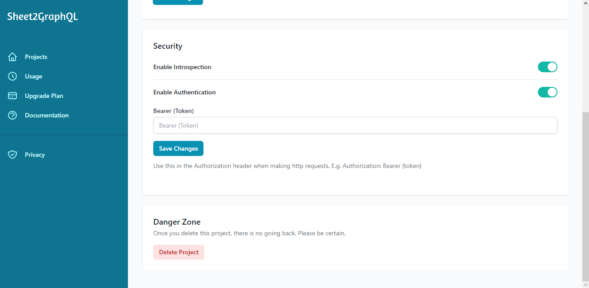

# Authentication

You can enable authentication for your project's from the project's settings page.

<figure markdown>
  { width="700" }
  <figcaption>Enable authentication for a project</figcaption>
</figure>

Once you've enable authentication for your project you will need to provide your bearer token in the authorization header when making queries to your GraphQL endpoint.

=== "Python"

    ``` python
    import requests

    # graphql endpoint
    api_url = "https://api.sheet2graphql.co/project/fcca5a6a-e5c9-4732-8ee2-748307c08e56"

    query = """
    {
        booksList{
            result{
                id
                category
                bookTitle
                price
                rating
            }
        }
    }
    """

    # set the authorization header
    headers = {
        "Authorization": "Bearer {your token}"
    }

    response = requests.post(url=api_url, json={"query": query}, headers=headers)
    print(response.json())
    ```

=== "JavaScript"

    ``` javascript
    const axios = require('axios')

    // graphql endpoint
    const api_url = "https://api.sheet2graphql.co/project/fcca5a6a-e5c9-4732-8ee2-748307c08e56"

    const query = `
    {
        booksList{
            result{
                id
                category
                bookTitle
                price
                rating
            }
        }
    }
    `

    axios({
        method: 'post',
        url: api_url,
        headers: { Authorization: "Bearer {your token}"},
        data: {
            "query": query
        }
    })
        .then(function (response) {
            console.log(response.data);
        })
        .catch(function (error) {
            console.log(error);
        })
    ```