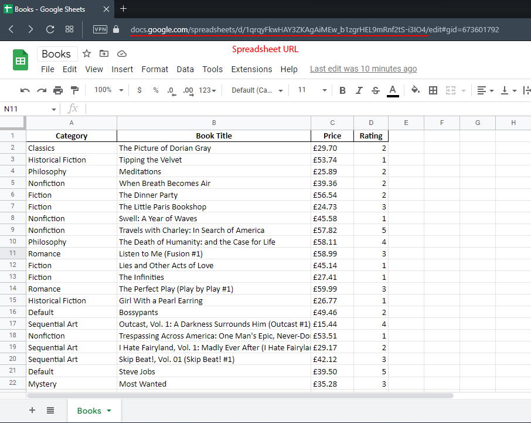
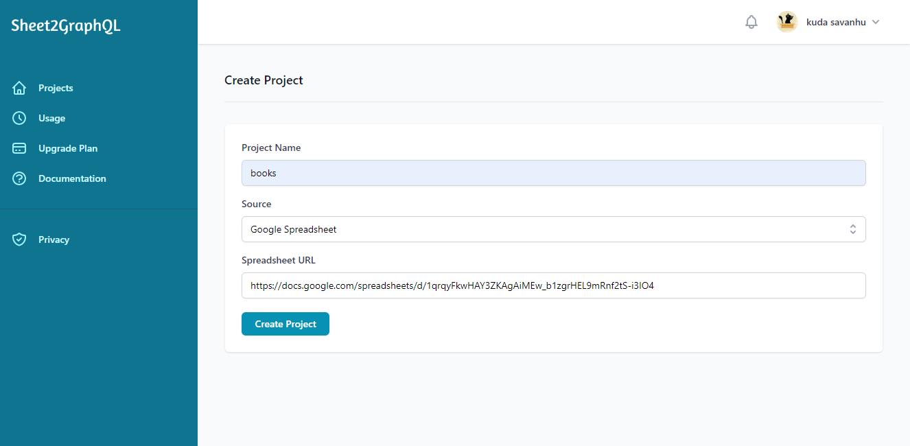
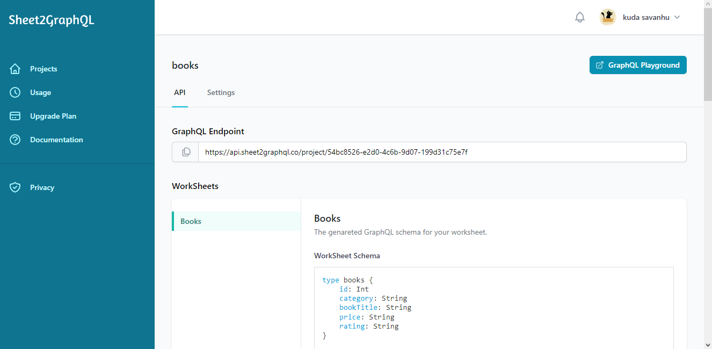
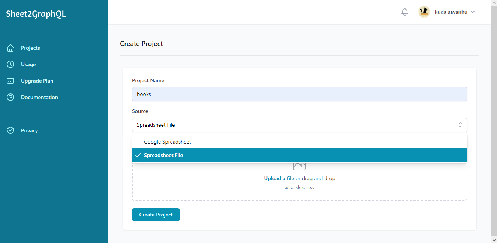
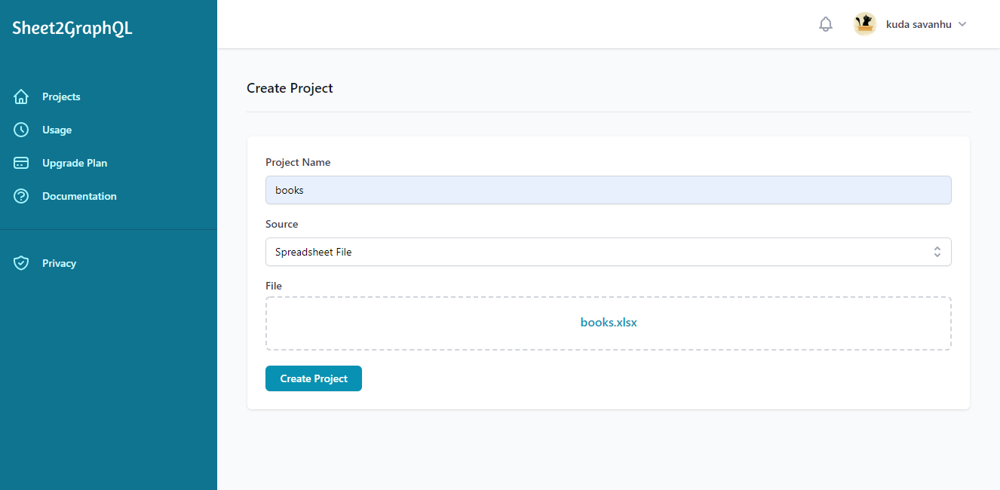

# Getting Started

## Preparing your worksheet

The first row of your worksheet will be used as the fields of your API, the headers must be made up of alphanumeric characters only. Take this worksheet below as an example:

|   | Category           | Book Title                 | Price           | Rating          |
|   | ------------------ | -------------------------- | --------------- | --------------- |
| 2 | Classics           | The Picture of Dorian Gray | £29.70          | 2               |
| 3 | Historical Fiction | Tipping the Velvet         | £53.74          | 1               |
| 4 | Philosophy         | Meditations                | £25.89          | 2               |
| 5 | Nonfiction         | When Breath Becomes Air    | £39.36          | 2               |
| 6 | Fiction            | The Dinner Party           | £56.54          | 2               |
| 7 | Fiction            | The Little Paris Bookshop  | £24.73          | 3               |


The fields ```Category```, ```Book Title```, ```Price``` and ```Rating``` will be used as the API fields resulting in the following GraphQL schema:

``` js
type books {
    id: Int
    category: String
    bookTitle: String
    price: String
    rating: String
}
```

!!! note ""

    Sheet2GrapQL will ‘camelCase’ your header names to make them more JSON friendly.

## Creating a project from Google sheets

To create your API from a Google spreadsheet you'll need to get the spreadsheet URL for the spreadsheet and paste it into Sheet2GraphQL

<figure markdown>
  { width="700" }
  <figcaption>1. Copy the spreadsheet URL</figcaption>
</figure>

Once you have your spreadsheet URL you can head over to the project creation page (https://dashboard.sheet2graphql.co/create-project) and paste the url into the "Spreadsheet URL" field:

<figure markdown>
  { width="700" }
  <figcaption>2. Create a project from a google sheet</figcaption>
</figure>

Give your project a name and click the "create project" button, you will then be redirected to your
project's page

<figure markdown>
  { width="700" }
  <figcaption>3. Project page</figcaption>
</figure>


## Creating a project from a spreadsheet file

To create GraphQL API from a spreadsheet file you must select the "Spreadsheet File" option on the "Source" dropdown.


<figure markdown>
  { width="700" }
  <figcaption>1. Select "Spreadsheet File" from the source dropdown</figcaption>
</figure>

When you select the "Spreadsheet File" option in the dropdown a file upload field will appear.

Then you can either drag and drop the spreadsheet file into file field or click the "Upload a file" link which will open a file selection dialogue. 

<figure markdown>
  { width="700" }
  <figcaption>2. Upload spreadsheet</figcaption>
</figure>

Once your file is successfully uploaded you can give your project a name and click the "create project"
button and you'll be redirected to your project's page

<figure markdown>
  { width="700" }
  <figcaption>3. Project page</figcaption>
</figure>