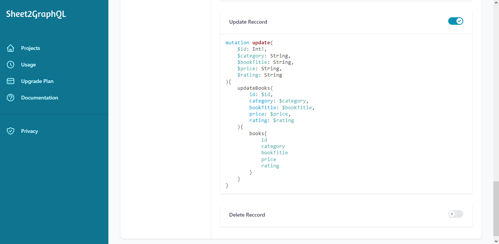

# Updating Rows

## Example data

|   | Category | Book Title | Price | Rating |
|   | ------------------ | -------------------------- | --------------- | --------------- |
| 2 | Classics | The Picture of Dorian Gray | £29.70 | 2 |
| 3 | Historical Fiction | Tipping the Velvet | £53.74 | 1 |
| 4 | Philosophy | Meditations | £25.89 | 2 |
| 5 | Nonfiction | When Breath Becomes Air | £39.36 | 2 |
| 6 | Fiction | The Dinner Party | £56.54 | 2 |
| 7 | Fiction | The Little Paris Bookshop | £24.73 | 3 |
.....
| 494 | Nonfiction | Changing stuff and seeing what happens | £25.89 | 10 |

## Example GraphQL schema

The GraphQL schema genarated from the example data

```js
type books {
    id: Int
    category: String
    bookTitle: String
    price: String
    rating: String
}

type Mutation {
    addBooks(
        category: String
        bookTitle: String
        price: String
        rating: String
    ): books

    updateBooks(
        id: Int!,
        category: String
        bookTitle: String
        price: String
        rating: String
    ): books

    deleteBooks(
        id: Int!
    ): books
}
```

!!! note ""

    The GraphQL schema for each of your worksheets is available on your project's page.

## Enable the option to update reccords

Mutations are disabled by default for each worksheet in your project, you can enable mutations for a worksheet from your project's page in the dashboard.

<figure markdown>
  { width="700" }
  <figcaption>Enable mutations for your project</figcaption>
</figure>

## Update a row

The GraphQL type for updating a row in your worksheet will be named in the following format:
 
```update{worksheet name}```

e.g. ```updateBooks```

The update mutation requires a "id" argument, the "id" value for a row is returned in the list query. Please refer to the list query in [Read Data](/read/#get-multiple-rows)

!!! note ""

    The arguments for the update mutation correspond to the headers of your worksheet.


=== "Python"

    ``` python
    import requests

    # graphql endpoint
    api_url = "https://api.sheet2graphql.co/project/fcca5a6a-e5c9-4732-8ee2-748307c08e56"

    query = """
    mutation{
        updateBooks(
            id: 494,
            price: "£29.70"
        ){
            books{
                id
                category
                bookTitle
                price
                rating
            }
        }
    }
    """

    response = requests.post(url=api_url, json={"query": query})
    print(response.json())
    ```

=== "JavaScript"

    ``` javascript
    const axios = require('axios')

    // graphql endpoint
    const api_url = "https://api.sheet2graphql.co/project/fcca5a6a-e5c9-4732-8ee2-748307c08e56"

    const query = `
    mutation{
        updateBooks(
            id: 494,
            price: "£29.70"
        ){
            books{
                id
                category
                bookTitle
                price
                rating
            }
        }
    }
    `

    axios({
        method: 'post',
        url: api_url,
        data: {
            "query": query
        }
    })
        .then(function (response) {
            console.log(response.data);
        })
        .catch(function (error) {
            console.log(error);
        })
    ```

The response body:

```json
{
    "data": {
        "updateBooks": {
            "books": {
                "id": 494,
                "category": "Nonfiction",
                "bookTitle": "Changing stuff and seeing what happens",
                "price": "£29.70",
                "rating": "10"
            }
        }
    }
}

```

The example content should now look like below:

|   | Category | Book Title | Price | Rating |
|   | ------------------ | -------------------------- | --------------- | --------------- |
| 2 | Classics | The Picture of Dorian Gray | £29.70 | 2 |
| 3 | Historical Fiction | Tipping the Velvet | £53.74 | 1 |
| 4 | Philosophy | Meditations | £25.89 | 2 |
| 5 | Nonfiction | When Breath Becomes Air | £39.36 | 2 |
| 6 | Fiction | The Dinner Party | £56.54 | 2 |
| 7 | Fiction | The Little Paris Bookshop | £24.73 | 3 |
.....
| 494 | Nonfiction | Changing stuff and seeing what happens | £29.70 | 10 |